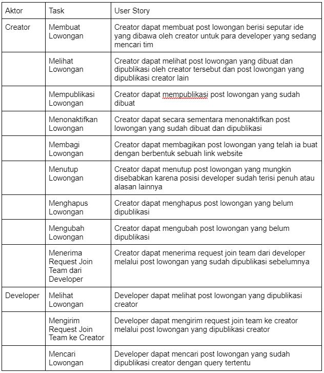
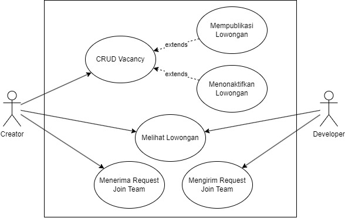
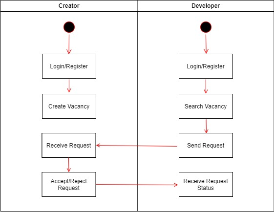
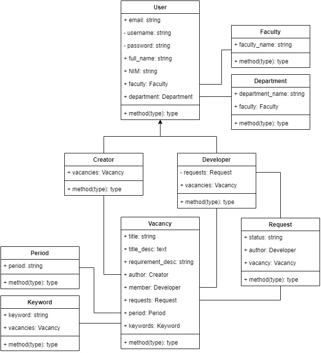

# Peron PKM (MPPL R2 Kelompok 2)

## Role anggota

| Anggota                              | Role      |
| ------------------------------------ | --------- |
| Muhammad Hamdan Nur Alam (G64190031) | Developer |
| Akaasyah Nurfath (G64190065)         | Developer |
| Yosar Awandi Porseda (G64190076)     | Developer |
| Malvin Palevi (G64190120)            | Developer |

## Latar belakang

```
    Program Kreativitas Mahasiswa (PKM) adalah forum untuk memfasilitasi calon mahasiswa Indonesia untuk belajar dan berkembang serta menerapkan ilmu pengetahuan dan teknologi yang dipelajari dalam perkuliahan kepada masyarakat luas. Di tahun 2020, IPB telah menghasilkan 546 proposal PKM untuk mendapatkan pendanaan kegiatan PKM.
```

```
    Namun, kendala yang seringkali dihadapi oleh mahasiswa untuk mengikuti PKM adalah mencari anggota tim yang cocok terhadap ide yang diajukan. Mahasiswa yang memiliki ide harus mencari calon anggota tim secara konvensional, yaitu mencari ke setiap departemen dan setiap angkatan. Seringkali mahasiswa tersebut harus menghubungi satu persatu kandidat yang sekiranya cocok untuk menjadi anggota tim. Selain itu, mahasiswa kesulitan mencari mahasiswa yang mau diajak untuk mengikuti kegiatan PKM.
```

```
    Platform hadir untuk membantu dalam menjembatani mahasiswa yang memiliki ide mengenai topik PKM dan sedang mencari anggota yang memiliki keahlian tertentu dengan mahasiswa keahlian di bidangnya yang ingin mengikuti PKM.
```

## Tujuan

```
    Membuat aplikasi platform yang dapat mempertemukan calon peserta PKM yang sudah memiliki ide dengan calon peserta PKM yang belum mendapatkan tim
```

## User story



## Cakupan

- Terbatas hanya untuk mahasiswa IPB S1 dan Vokasi
- Hanya berbentuk platform penghubung (tidak ada chatbox atau media penghubung langsung lainnya)
- Terbatas hanya untuk kegiatan PKM
- Terbatas hanya dapat digunakan mahasiswa IPB tetapi dapat diakses umum
- User hanya dapat menjadi dua role antara lain ketua dan anggota

## Kebutuhan sistem (user, fitur utama, lingkungan pengembangan)

## Risiko

| Risiko                 | Deskripsi                                                                                                    | Upaya yang dilakukan                                                                                                   |
| ---------------------- | ------------------------------------------------------------------------------------------------------------ | ---------------------------------------------------------------------------------------------------------------------- |
| Perubahan Desain       | Tim ingin menyesuaikan desain perangkat lunak projek yang sesuai dengan boilerplate framework yang digunakan | Melakukan pertemuan seluruh anggota tim dan memeriksa requirement perangkat lunak                                      |
| Perubahan jumlah fitur | Tim ingin mengurangi jumlah fitur yang dikembangkan                                                          | Melakukan pertemuan seluruh anggota tim untuk menyepakati keputusan dan menyesuaikan perangkat lunak yang dikembangkan |

## Metodologi

Agile Sprint

## Use case



## Activity Diagram



## Class Diagram/ERD



## Link video demo

## Link sheet test case

- (dah ada hasil testingnya)

## Link deploy

```
https://peron-pkm.000webhostapp.com/
```

## Link figma

```
https://www.figma.com/file/Hr6N6XypkZZ1qXHYbFgmns/PeronPKM-MPPL?node-id=424%3A98&t=cNkSHJHkHk217pW0-1
```

## Kendala

## Installation

- Install seluruh package dengan composer
  ```
  composer install
  ```
- Copy file `.env.example` ke menjadi file `.env`. Atur konfigurasi DB, dll.
- Generate key dengan menggunakan command
  ```
  php artisan key:generate
  ```
